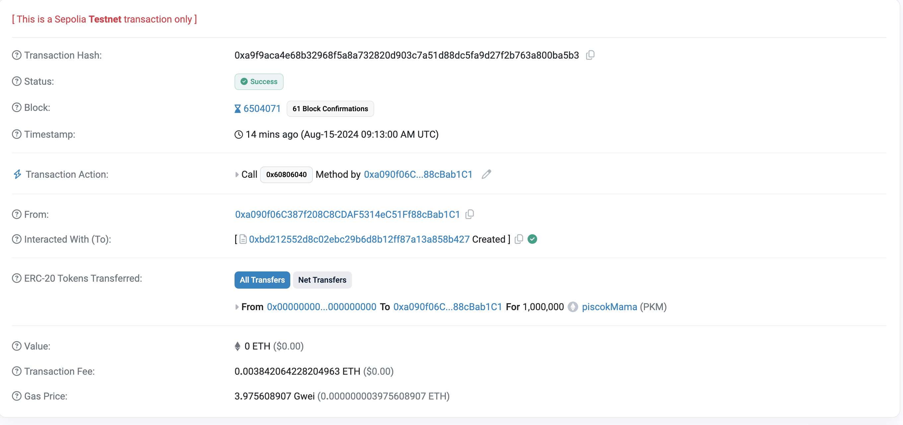

## Day 1
# SetUp hardhat
 * https://hardhat.org/hardhat-runner/docs/getting-started#quick-start

# Strukturnya foldernya:
    - contracts = untuk tempat buat code smart contracts nya
    - ignition/modules = untuk tempat code deploy nya
    - test = untuk tempat code test nya
    - scripts = untuk tempat code yang berinstraksi dengan smart contract nya

# command nya:
    - npx hardhat compile  (buat compile)
    - npx hardhat node  (jalanin node di local)
    - npx hardhat ignition deploy ./ignition/modules/nama_file.js --network localhost  (buat deploy di local)
    - npx hardhat run scripts/nama_file.js --network localhost (jalanin intraksi code ke smart contract nya)

# SetUp Metamask:
 *dapat alamat nya dari jalanin command "npx hardhat node"
    - nama jaringan     = localhost::8545
    - URL RPC Baru      = http://127.0.0.1:8545
    - ID chain          = 31337
    - Simbol mata uang  = ETH

# Format nama file:
 * test_HariKe_Cuy-_buat_apa.(js,ty,sol)
 contoh: "testPertama-pengenalan.js"


## Day 2
# setUp Frontend:
- buat abi.js, dapat data abinya dapet dari ./ignition/deployments/chain-31337/artifactsTestGwIni#testPertamaCuy.dbg.json / nama file contract nya
- connect ether js, ES3 (UMD) in the Browser / ES6 in the Browser
```js
// <!-- dari ether.js, kayak expo tapi buat blockchain "https://docs.ethers.org/v5/" -->
<script src="https://cdn.ethers.io/lib/ethers-5.2.umd.min.js" type="application/javascript"></script>
```
- code yang penting:
```js
// Connect contract
let provider
let user
let ytContract
async function connect(){
    await ethereum.request({ method: 'eth_requestAccounts' }); 
    provider = new ethers.providers.Web3Provider(window.ethereum); // connect ke metamask, ada di docs ether js
    user = await provider.getSigner() // dapetin data dari user yang intract smart contract nya
    console.log(user, ">>>>>");

    // ytContract = new ethers.Contract(Deployed_Addresses, abi, provider)
    ytContract = new ethers.Contract("0x5FbDB2315678afecb367f032d93F642f64180aa3", abi, provider) // connect ke contractnya
}
```

```js
// html
<input type="text" id="textRaw" placeholder="Enter text">
<button onclick="setText()">Set Text</button>
<button onclick="loadData()">Load Data</button>
<p id="pemilik"></p>
<p id="rawText"></p>
<p id="angka"></p>
<p id="error"></p>

// load data
async function loadData(){
    try {
        document.getElementById("pemilik").innerText = await ytContract.getPemilik() 
        document.getElementById("rawText").innerText = await ytContract.textIki()
        document.getElementById("angka").innerText = await ytContract.angka()
    } catch (error) {
        console.error("Error calling getPemilik:", error)
        document.getElementById("error").innerText = "Error: " + error.message
    }
}
```

```js
// set input 
// ytContract dari "connect contract"
async function setText() {
    const textValue = document.getElementById("textRaw").value // input data baru
    const yt = await ytContract.connect(await provider.getSigner()) // connect user yang ke smart contract
    console.log(yt, "!?@?!@?!?");
    await yt.setTextIki(textValue) // set text nya
    await loadData() // refresh data
}
```

```js
// increment
// ytContract dari "connect contract", btw cuman owner yang bisa increment nya
async function incrementContract() {
    const yt = await ytContract.connect(await provider.getSigner()) // connect user yang ke smart contract
    await yt.increment() // increment nya
    await loadData() // refresh data
}
```

## Final Deploy to erc20 sepolia
### SET UP SEPOLIA
- 1. buat env sesuai example nya

- 2. tambahin hardhat confignya:
```js
require("@nomicfoundation/hardhat-toolbox"); // dari had hat jadi gak perlu donwload lagi
require("dotenv").config(); // ini install "npm i dotenv"

/** @type import('hardhat/config').HardhatUserConfig */
module.exports = {
  solidity: "0.8.24",
  networks: {
    sepolia: {
      url: process.env.SEPOLIA_URL, // cek inv 
      accounts: [process.env.PRIVATE_KEY], // cek inv 
    },
  },
};
```

- 3. buat contractnya, contoh:
```js
// SPDX-License-Identifier: UNLICENSED
pragma solidity ^0.8.24;

import "@openzeppelin/contracts/token/ERC20/ERC20.sol"; // donwloaad dulu "npm i @openzeppelin/contracts atau npm install @openzeppelin/contracts-upgradeable (dari 'https://docs.openzeppelin.com/contracts/4.x/upgradeable')"

contract MyToken is ERC20 { // initial tambahin
    constructor(uint256 initialSupply) ERC20("piscokMama", "PKM") { // disini juga
        _mint(msg.sender, initialSupply);
    }
}
```

### COMMAND DEPLOYNYA
```js
npx hardhat compile // keknya optional dah
npx hardhat ignition deploy ignition/modules/nama_files.js --network sepolia // networknya sepolia
```

### LINK YANG MENDUKUNG
- https://faucets.chain.link/ (buat free faucet butuh github) 
- https://www.infura.io/ (buat dapetin link sepolia nya)
- sepolia.etherscan.io (buat cek contract nya dah di deploy atau enggak)
- https://docs.openzeppelin.com/contracts/5.x/ (buat docs ERC nya)

## DOCUMENTASI NYA JANGAN LUPE EHEHEH

# PISCOK MAMA CUYY?!?!!

### setiap perubahan harus di refresh
